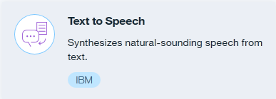
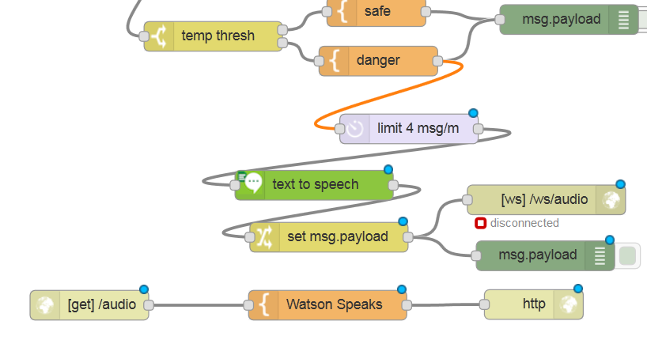
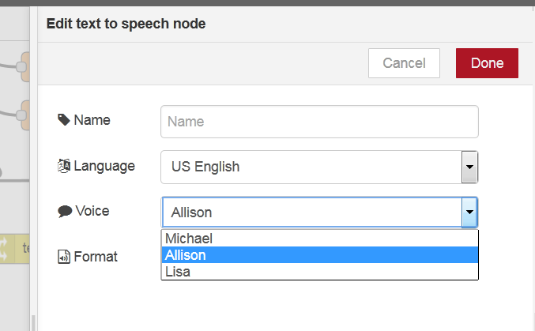
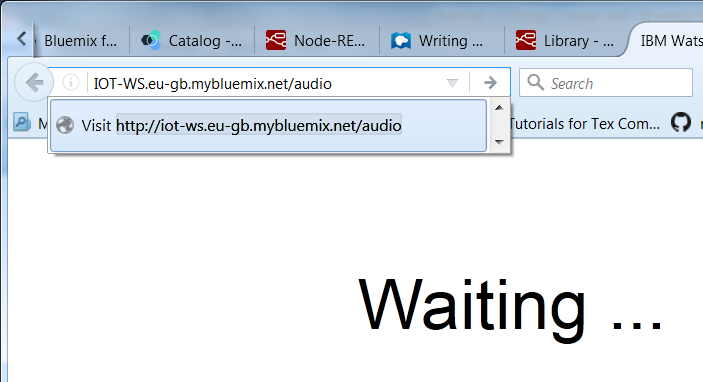

At this stage, we can enhance the alerting process by producing a spoken version
of the high temperature alert.

The Watson **Text to Speech** service can be connected to the Node-RED
application through the Bluemix console dashboard; select your IOT-WS
application to see the Connections view, and click on the

button and connect an instance of the Text to Speech service:

You will be prompted to Restage the application -- this will restart Node-RED
after refreshing the application runtime environment to include the information
needed to connect to the WATSON API service that provides the Text to Speech
functions. The Restage process for Node-RED application currently takes 3-5
minutes.

Once Node-RED has restarted, refresh your browser view of the Node-RED flow
editor. You can now add spoken word functionality to your application.

A simple mechanism can be used by importing the following flow into Node-RED:

This will add a flow which creates a spoken version of text alerts generated
when the temperature exceeds the danger threshold, and a flow which will allow
the speech to be played through your browser. Connect the flow to the `danger`
node, as shown:

This process makes use of "websockets" -- creating an open tunnel between the
application in Node-RED and the audio support of the browser [**Firefox or
Chrome**].

If you open the `text to speech` node, the editing form provides a selection of
voices that can be used to speak your text:

You can also select different languages -- be aware that this will not translate
the messages into that language, only that the voice will say the words as if
they were in that language (you can get some very weird accent effects!).

To hear the speech sounds, launch another browser window, and connect to the
`/audio` page of your Node-RED application:

Now when your sensor indicates a temperature higher than the threshold set for
danger, you will hear the alert message spoken. You can, of course, modify the
message to include instructions -- to investigate, evacuate, repair, etc.